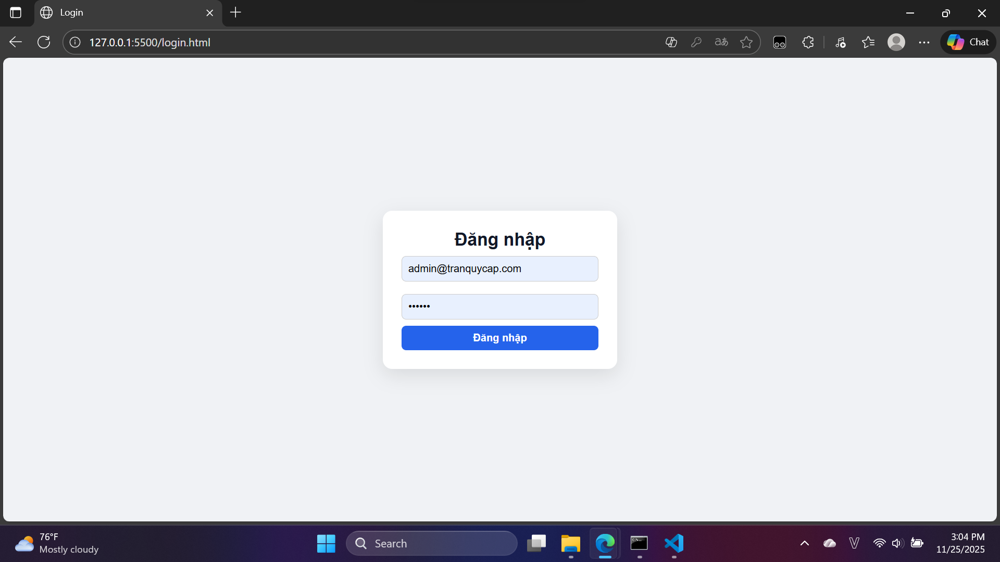
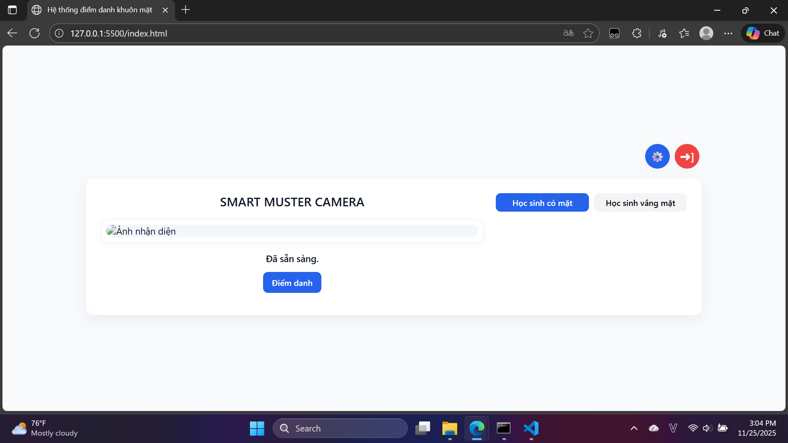

# SMART MUSTER CAMERA – Hệ thống điểm danh và chấm công thông minh

Xin chào! Mình là **Nguyễn Công Thuận Huy**. Đây là câu chuyện về dự án KHKT mà mình dành nhiều tối để viết code, sửa bug và học hỏi thêm về thị giác máy tính. README này vừa là nhật ký hành trình, vừa là tài liệu giúp mọi người hiểu cách mình dựng nên hệ thống nhận diện khuôn mặt để điểm danh tự động.

---

## Hành trình viết code

| Giai đoạn | Điều mình đã làm |
|-----------|------------------|
| **Khởi động** | Bắt đầu với ý tưởng: thay vì điểm danh thủ công, camera sẽ tự nhận diện bạn nào có mặt. Mình test nhanh bằng Python notebook rồi chuyển dần thành module `FaceSystem`. |
| **Tách lớp kiến trúc** | Khi cần UI và điều khiển từ xa, mình chia project thành 3 phần: `web-ui` giao diện, `api-gateway` điều phối, `python-worker` xử lý camera. Việc tách vậy giúp debug dễ hơn nhiều. |
| **Tối ưu thực tế** | Học cách cân bằng giữa tốc độ và độ chính xác: giảm kích thước frame, thêm bước enhance ảnh yếu sáng (`enhanceImage`) và cơ chế queue lệnh để worker không bị “ngộp”. |
| **Hoàn thiện trải nghiệm** | Bổ sung đăng nhập JWT, popup cấu hình giờ auto chụp, hiển thị ảnh thumbnails, và log đẹp bằng `FancyText` để khi chạy trên Raspberry Pi mình vẫn nhìn rõ mọi trạng thái. |

---

## Kiến trúc tổng quan

```
web-ui (HTML/CSS/JS)  <--JWT-->  api-gateway (Express)
                                   ↑
                                HTTP Poll
                                   ↓
                      python-worker (OpenCV + InsightFace)
                                   ↓
                              Camera RTSP
```

- `web-ui/`: SPA nhỏ cho giáo viên đăng nhập, xem ảnh, theo dõi danh sách có/không có mặt và chỉnh cấu hình giờ tự chụp.
- `api-gateway/`: REST API bảo vệ bằng JWT, lưu cache điểm danh, hàng đợi lệnh (`/api/command/*`) và cấu hình gửi xuống worker.
- `python-worker/`: chạy trên máy gần camera. Poll lệnh từ Gateway, đọc luồng RTSP, nhận diện bằng InsightFace, gửi kết quả ngược lại.

---

## Giao diện trực quan




## Chức năng chính

- **Điểm danh theo lệnh**: nút “Điểm danh” trên web gọi `POST /api/command/trigger_checkin`, Gateway đẩy lệnh vào queue và worker thực thi.
- **Điểm danh tự động theo giờ**: worker chạy `autoCapture()` so khớp `image_capture_interval` để gửi kết quả định kỳ ngay cả khi không ai bấm nút.
- **Quản lý cấu hình từ xa**: giao diện cho phép chỉnh `retry_delay`, `face_recognition_threshold`, `frame_count`, danh sách giờ chụp; Gateway gom lại rồi worker nhận qua command `update_config`.
- **Khử nhiễu ảnh**: trước khi nhận diện, mỗi frame đi qua `enhanceImage()` để cân bằng sáng, tăng nét và scale xuống 640px giúp giảm băng thông khi gửi base64.
- **Theo dõi hiện diện trực quan**: web hiển thị khung hình chính + các thumbnail, kèm danh sách `present/absent` cập nhật tự động 15 giây/lần.
- **Bảo mật nhẹ nhàng**: đăng nhập qua `POST /api/login`, phát JWT 8 giờ; mọi endpoint quan trọng đều yêu cầu `Authorization: Bearer <token>`.

---

## Ứng dụng thực tế

- Điểm danh lớp học sáng sớm: chỉ cần bật camera IP và mở web trên điện thoại giáo viên.
- Phụ huynh có thể quan sát và theo dõi chuyên cần của con em mình.
- Giám sát câu lạc bộ hoặc phòng thí nghiệm: dễ dàng thêm ảnh thành viên mới vào `python-worker/data/faces` rồi chạy lại `FaceSystem.registerFace`.
- Nghiên cứu KHKT: bộ mã nguồn này giúp mình trình bày rõ cách phối hợp IoT (camera), AI (nhận diện khuôn mặt) và web (giao diện điều khiển) trong một hệ thống hoàn chỉnh.

---

## Công nghệ & thư viện

- **Python**: InsightFace, OpenCV, NumPy, Requests, ThreadPoolExecutor.
- **Node.js/Express**: JWT auth, queue lệnh, CORS, dotenv.
- **Frontend**: HTML/CSS thuần, fetch API, localStorage token.
- **Cơ sở dữ liệu**: Dữ liệu khuôn mặt lưu bằng `pickle`; cache điểm danh lưu trong bộ nhớ Gateway (đủ cho quy mô nhỏ).

---

## Cách mình chạy dự án

1. **Cấu hình môi trường**
   ```bash
   # api-gateway/.env
   PORT=4000
   JWT_SECRET=supersecret
   ADMIN_EMAIL=admin@example.com
   ADMIN_PASSWORD=123456
   ```
   ```bash
   # python-worker/.env
   API_GATEWAY_URL=http://localhost:4000
   RTSP_URL=rtsp://user:pass@ip:554/stream
   ```

2. **Khởi chạy Gateway**
   ```bash
   cd api-gateway
   npm install
   npm start
   ```

3. **Cài và chạy Worker**
   ```bash
   cd python-worker
   python -m venv .venv
   .venv\Scripts\activate
   pip install -r requirements.txt
   python worker.py
   ```

4. **Mở giao diện**
   - Dùng bất kỳ server tĩnh nào (hoặc `Live Server`) để host `web-ui/`.
   - Đăng nhập bằng tài khoản trong `.env` và bắt đầu điểm danh.

---

## Định hướng tương lai

- Lưu lịch sử điểm danh vào database (PostgreSQL hoặc Firestore) để phân tích dài hạn.
- Thay queue `polling` bằng WebSocket để giảm độ trễ.
- Thêm cơ chế “two-factor” khi đăng nhập để an toàn hơn nếu triển khai bên ngoài lớp học.


